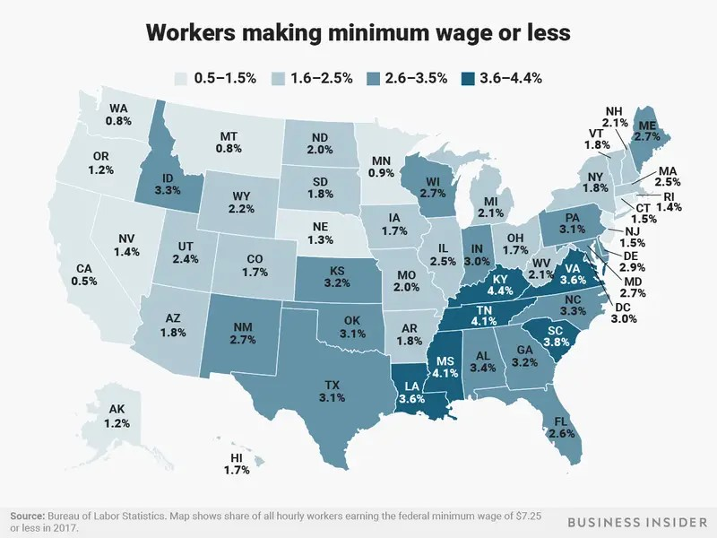

| [home page](https://jrshore.github.io/jshore-portfolio/) | [visualizing debt](visualizing-government-debt) | [critique by design](critique-by-design) | [final project I](final-project-part-one) | [final project II](final-project-part-two) | [final project III](final-project-part-three) |

# Critique By Design - How Many People in Each State Make Minimum Wage or Less

Kiersz, Andy. ‘Amazon Will Raise Workers’ Minimum Wage to $15 an Hour, More than Twice the Federal Minimum — Here’s How Many People in Each State Make Minimum Wage or Less’. Business Insider. Accessed 15 November 2023. https://www.businessinsider.com/federal-minimum-wage-workers-map-2018-10.

I chose to critique this design because I thought it already looked relatively nice, but as they say, there is always room for improvement. I wanted to figure out how to improve this design to be more beneficial to a different audience. I also wanted to figure out how to tell the story differently without a map because, while maps are interesting to look at, they usually don't offer as much information as I would prefer. 

Originally, my goal was to see what people think is important for this topic. I did not update the numbers from the 2017 information given in the original chart so that I could make a visualization that only contains the same information but in a different way. Therefore, I created this series of data charts to receive feedback on.

<noscript></noscript><object class='tableauViz'  style='display:none;'><param name='host_url' value='https%3A%2F%2Fpublic.tableau.com%2F' /> <param name='embed_code_version' value='3' /> <param name='path' value='shared&#47;5QMJWHN8B' /> <param name='toolbar' value='yes' /><param name='static_image' value='https:&#47;&#47;public.tableau.com&#47;static&#47;images&#47;5Q&#47;5QMJWHN8B&#47;1.png' /> <param name='animate_transition' value='yes' /><param name='display_static_image' value='yes' /><param name='display_spinner' value='yes' /><param name='display_overlay' value='yes' /><param name='display_count' value='yes' /><param name='language' value='en-US' /></object>
                

The feedback I received was not what I was going for. I thought I had created a great set of data to tell a story with, but it was not read the same way by my audience. My feedback was the following:

|           Questions          |             Male, late 20s             |               Female, mid 50s              |
|------------------------------|----------------------------------------|--------------------------------------------|
| Can you tell me what you think this is? | It’s giving percentages of state populations that make at or below minimum wage. | A set of charts comparing the percentage of people making at or below minimum wage in states who have adopted a higher minimum wage with states who have not. |
| Can you describe to me what this is telling you? | The first graphic tells me everything I need about the country, the second graphic shows me states that have a higher minimum wage than federal, the third graphic shows states that have federal minimum wage. | That most employees make more than minimum wage. |
| Is there anything surprising or confusing? | No | No |
| Who do you think is the intended audience for this? | The Department of Labor. | Employers? |
| Is there anything you would change or do differently? | No. | No.|
| Which of these graphics do you think has the most compelling story to tell? | The third one because the cost of living keeps going up but people still aren’t making enough money to live, especially if it’s below minimum wage. But the first one is also really important because I can compare all the states. | The 3rd one. It shows  that states without a minimum wage greater than the federal have more people at or below minimum wage, which makes sense. |

I went back to the drawing board. I decided to make a more specific story that I wanted to tell. Instead of just using the data from 2017 as the original chart uses, I chose to make a visualization that utilizes all of the information provided to create a look over time for a different comparison. My new focus became to show how Pennsylvania compares with its 19 other states who recognize the federal minimum wage as their state's minimum wage. 

At first I only included Pennsylvania's information. It looks great and can tell a great, one-sided story. I thought that I found the perfect chart, so I asked the same people for feedback on this new visualization. My results were more what I was looking for, but there was something that stuck out to me. When asked if the viewer would do anything different, one respondant said they would like to see a comparison with the rest of the states. 

|           Questions          |             Male, late 20s             |               Female, mid 50s              |
|------------------------------|----------------------------------------|--------------------------------------------|
| Can you tell me what you think this is? | It’s about how PA is doing better than everyone else about paying their workers above minimum wage. | A chart reflecting the number of employees in Pennsylvania making at or below minimum wage. |
| Can you describe to me what this is telling you? | | That Pennsylvania typically pays higher than minimum wage. |
| Is there anything surprising or confusing? | No | I am surprised that Pennsylvania doesn’t have a higher than federal minimum wage. |
| Who do you think is the intended audience for this? | The Department of Labor. | Employers? |
| Is there anything you would change or do differently? | No | I would include the National numbers so there is a comparison. |
| What information were you able to pick up/learn? Is it helpful and/or beneficial to you? | The info provided shows that PA is paying their workers better than minimum wage without increasing their own minimum wage requirements. | I learned Pennsylvania typically pays higher than the National minimum wage… But that isn’t saying a whole lot since federal minimum isn’t very high. |
| Which did you think was better? | The second one. It was cleaner. |  |

So, back to the drawing board I went. I could tell a story that paints Pennsylvania in the best light, or I could look at the rest of the data and tell a true story. I went back to my data and created new tables and finding national averages to compare to Pennsylvania. I was shocked to find that Pennsyvania was not performing as well as I initially thought. This made me want to create a chart to show Pennsylvania's specific progress, but also a comparison to the other states who recognize the federal minimum wage as their own minimum wage. 

<noscript></noscript><object class='tableauViz'  style='display:none;'><param name='host_url' value='https%3A%2F%2Fpublic.tableau.com%2F' /> <param name='embed_code_version' value='3' /> <param name='site_root' value='' /><param name='name' value='PAMinimumWageChart&#47;Story1' /><param name='tabs' value='no' /><param name='toolbar' value='yes' /><param name='static_image' value='https:&#47;&#47;public.tableau.com&#47;static&#47;images&#47;PA&#47;PAMinimumWageChart&#47;Story1&#47;1.png' /> <param name='animate_transition' value='yes' /><param name='display_static_image' value='yes' /><param name='display_spinner' value='yes' /><param name='display_overlay' value='yes' /><param name='display_count' value='yes' /><param name='language' value='en-US' /></object>
                
