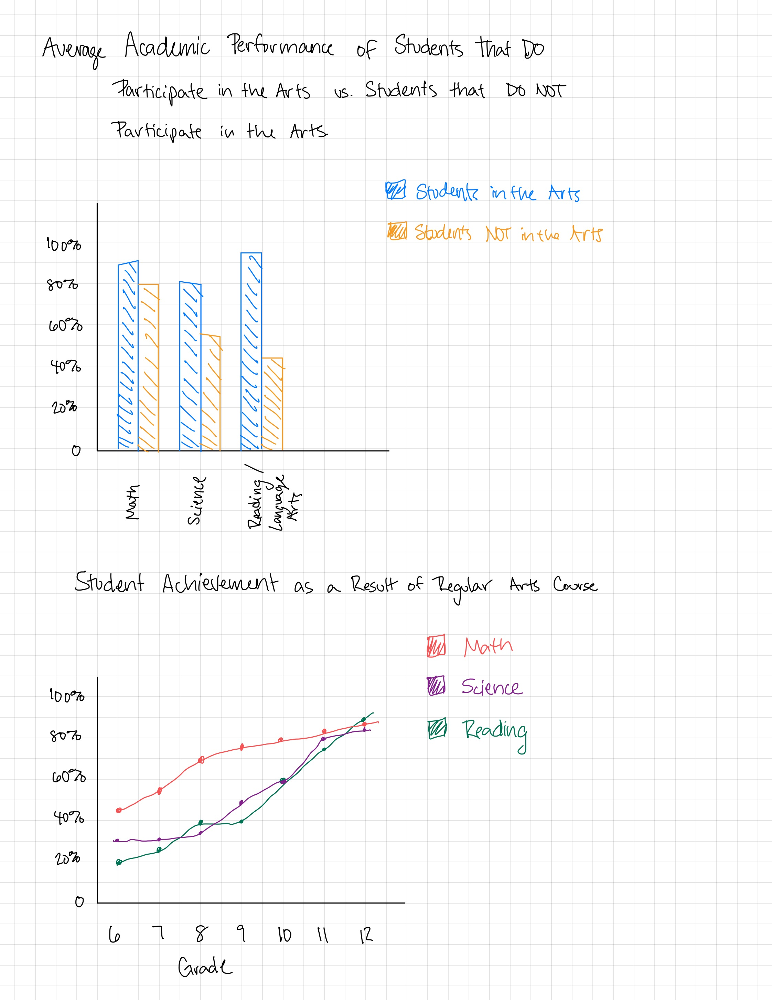

| [home page](https://jrshore.github.io/jshore-portfolio/) | [visualizing debt](visualizing-government-debt) | [critique by design](critique-by-design) | [final project I](final-project-part-one) | [final project II](final-project-part-two) | [final project III](final-project-part-three) |

# Outline
 
For my final project, I want to focus on showing the impact of the arts, including physical art, dance, music, and/or theatre, on student academic achievement. I grew up always invested in the arts, I chose to complete a bachelors degree in music education, and now I am seeking to find a career that engages the community in the arts. From my own experience and from prior research I have completed, the arts have a significant impact on the success of students in science, math, reading, and history. How often do children learn songs about math or history to help in learning? "Schoolhouse Rock!" was an educational series that taught kids catchy tunes to learn and remember educational subjects. While this was created in the 1970s, teachers still use this useful tool for education today. 

I want to utilize national data from the National Endowment for the Arts in tandem with data from the Department of Education to create a broad, national view. If possible, I also want to find information regarding a state-by-state case study of children involved in the arts vs children not involved in the arts to study the grades received. My goal is to not make broad generalizations, but rather to pinpoint ages where this information is most true and if there are specific types of art that benefit students more than others, such as music vs theatre.  

The arts are a difficult subject to get many people on board with, simply because they are not considered "core classes" in education, but rather as extra-curriculars. Additionally, high performance in the arts does not generate as much grant funding for schools as high performance in math and science, so superindendants often do not care to listen to arguments for funding the arts in schools. My story arch would start medium to high in emotion to make the reader feel good as they start reading the story report. This is to hopefully draw in the reader and encourage them to continue to read, even when the story begins to drop in "feel-good" and begins to talk about the nitty-gritty of the report. Most people do not enjoy reading data, but my goal will be to keep the data interesting. I hope to find direct quotes about the importance of the arts for student success not just from the researchers, but from the students, as well. Once the data has been shown, the goal will be to show how this can impact children now. I want to make the argument that if schools spend more in the arts, they will see higher grades in the other subjects that they are seeking. It's all too common for the arts to be the first subject to lose funding from the school and/or district. With this data, there will be no denial of the importance the arts have on student success across all subjects. By the end of the story, I want people to be ready to make changes in the budget. I want parents to be encouraged to attend PTO meetings, teachers to be encouraged to stand up for their art, principles ready to make a change in their schools, and superintendants ready to make a change to improve their district of students. 

*My initial story arc*

## Initial sketches

 
My goal is to show that students who participate in the arts have higher academic achievements than students who do not regularly participate in the arts. The arts are broad as of now, but if I struggle to find data, then I will specifically focus on music or theatre. These sketches would come towards the end of the story arc as a lead into the call-to-action plan. By demonstrating that the arts are a fundamental part of a child's learning and actually helps them to achieve better scores in their "core" classes, my audience will be more inclined to advocate for fundraising for the arts in schools. The data that would come prior to these sketches would show academic scores prior to arts engagement or from a control group of students who did not have regular arts classes. If I create visualizations for that information, it would likely be a report card by grade or utilizing similar graphics that are easy to understand in demonstrating poor academic performance. 

# The data
> A couple of paragraphs that document your data source(s), and an explanation of how you plan on using your data. 

At this moment, my data comes from research papers and government organization reports. I have not yet located the raw data in an Excel file or spreadsheet to utilize in creating my own visualizations, but I am still on the lookout for them. Some of the statistics I want to put into a graphic to feature callout statistics and utilize iconography, as is common in the education field. 

| Name | URL | Description |
|------|-----|-------------|
| Selection Into, and Academic Benefits from, Arts-Related Courses in Middle School Among Low-Income, Ethnically Diverse Youth | [PDF](https://www.arts.gov/sites/default/files/Research-Art-Works-GeorgeMason2.pdf) | This is the culmination of research that was funded by the National Endowment for the Arts that looked at school readiness of diverse youth and looked at liklihood of participating in the arts and academic achievement associated with those who did and did not participate in arts courses. |
| New NEA Research Report Shows Potential Benefits of Arts Education for At-Risk Youth | [Report](https://www.arts.gov/news/press-releases/2012/new-nea-research-report-shows-potential-benefits-arts-education-risk-youth) | Research from the National Endowment for the Arts reports that at-risk students who participate in the arts are more likely to have higher academic achievement, engage civically, and set higher personal life and career goals. |
| Music Education, Academic Achievement and Executive Functions | [Overview](https://www.artsedsearch.org/study/music-education-academic-achievement-and-executive-functions/) | This gives a summative overview of the abstract, key findings, methodology, and limitations of the research conducted. |

# Method and medium
> In a few sentences, you should document how you plan on completing your final project. 

Text here...
