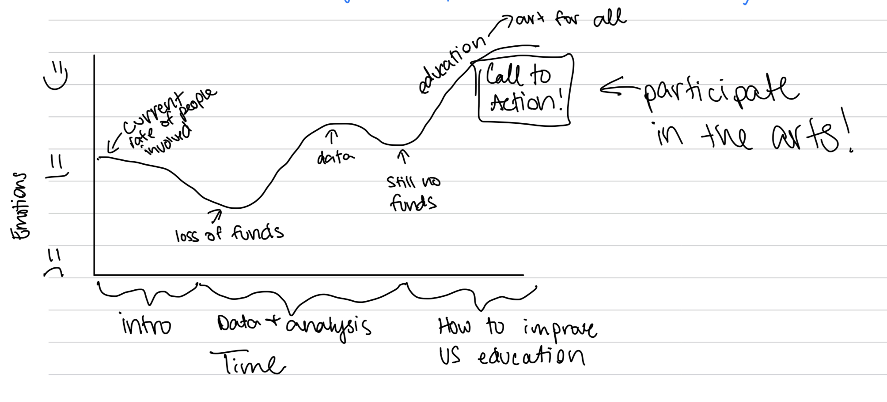

| [home page](https://jrshore.github.io/jshore-portfolio/) | [visualizing debt](visualizing-government-debt) | [critique by design](critique-by-design) | [final project I](final-project-part-one) | [final project II](final-project-part-two) | [final project III](final-project-part-three) |

# Outline
> Include a high-level summary of your project.  This should be a couple paragraphs that describe what you're interested in showing with your final project. 
 
For my final project, I want to focus on showing the impact of the arts, including physical art, dance, music, and/or theatre, on student academic achievement. I grew up always invested in the arts, I chose to complete a bachelors degree in music education, and now I am seeking to find a career that engages the community in the arts. From my own experience and from prior research I have completed, the arts have a significant impact on the success of students in science, math, reading, and history. How often do children learn songs about math or history to help in learning? "Schoolhouse Rock!" was an educational series that taught kids catchy tunes to learn and remember educational subjects. While this was created in the 1970s, teachers still use this useful tool for education today. 

I want to utilize national data from the National Endowment for the Arts in tandem with data from the Department of Education to create a broad, national view. If possible, I also want to find information regarding a state-by-state case study of children involved in the arts vs children not involved in the arts to study the grades received. My goal is to not make broad generalizations, but rather to pinpoint ages where this information is most true and if there are specific types of art that benefit students more than others, such as music vs theatre.  

> A project structure that outlines the major elements of your story.  Your Good Charts text talks about story structure in Chapter 8 - you should describe what you hope to achieve.  Make sure the outline is detailed enough that we can see how you anticipate your story unfolding.  You can incorporate your Story Arc from the in-class exercise along with your user stories and one sentence summary to make the topic even more clear. 

The arts are a difficult subject to get many people on board with, simply because they are not considered "core classes" in education, but rather as extra-curriculars. Additionally, high performance in the arts does not generate as much grant funding for schools as high performance in math and science, so superindendants often do not care to listen to arguments for funding the arts in schools. My story arch would start medium to high in emotion to make the reader feel good as they start reading the story report. This is to hopefully draw in the reader and encourage them to continue to read, even when the story begins to drop in "feel-good" and begins to talk about the nitty-gritty of the report. Most people do not enjoy reading data, but my goal will be to keep the data interesting. I hope to find direct quotes about the importance of the arts for student success not just from the researchers, but from the students, as well. Once the data has been shown, the goal will be to show how this can impact children now. I want to make the argument that if schools spend more in the arts, they will see higher grades in the other subjects that they are seeking. It's all too common for the arts to be the first subject to lose funding from the school and/or district. With this data, there will be no denial of the importance the arts have on student success across all subjects. By the end of the story, I want people to be ready to make changes in the budget. I want parents to be encouraged to attend PTO meetings, teachers to be encouraged to stand up for their art, principles ready to make a change in their schools, and superintendants ready to make a change to improve their district of students. 

## Initial sketches
> Post images of your anticipated data visualizations (sketches are fine). They should mimic aspects of your outline, and include elements of your story.  

# The data
> A couple of paragraphs that document your data source(s), and an explanation of how you plan on using your data. 

Text here...

> A link to the publicly-accessible datasets you plan on using, or a link to a copy of the data you've uploaded to your Github repository, Box account or other publicly-accessible location. Using a datasource that is already publicly accessible is highly encouraged.  If you anticipate using a data source other than something that would be publicly available please talk to me first. 

| Name | URL | Description |
|------|-----|-------------|
|      |     |             |
|      |     |             |
|      |     |             |

# Method and medium
> In a few sentences, you should document how you plan on completing your final project. 

Text here...
